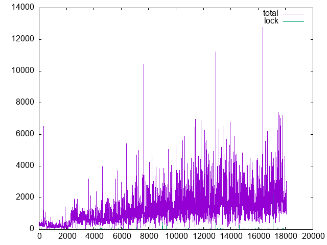
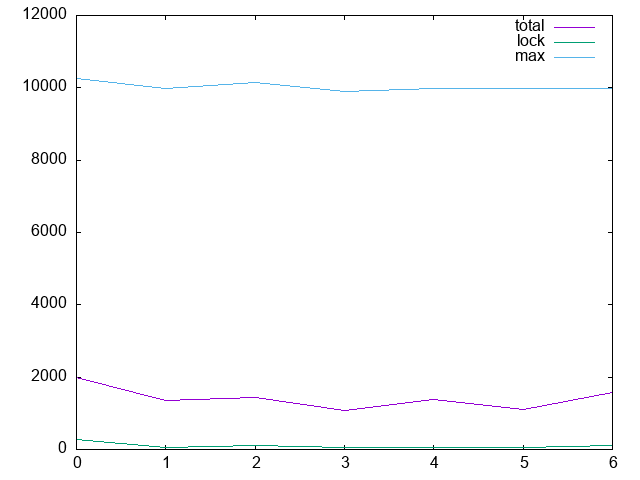

# Process profiling for locks

Added timed locks, with a very pessimistic 100ms timeout. Three test scenarios:

- Playback: simple playback through the georgyporgy tutorial track
- Export: exporting that track, without @mauser's fixes
- Messup: messing around and eventually filling up every 1/6th note on every instrument for maximum polyphonic note processing at one time. A couple of LADSPA plugins were enabled for good measure, a chorus effect and a 4 point EQ. Since I was filling up the pattern interactively at the time, this editing added a lot of GUI locks.

Using a Raspberry Pi 4 with buffer size set to 1024, all times in microseconds. Taking only cases where the lock isn't immediately acquired in order to remove scheduling noise, the most interesting case was the 'messup' case.

Over time, this plot shows the time taken to acquire the lock, time taken to process the buffer (which includes some kernel processor scheduling noise):

The processing time increases towards the end as I filled up the pattern.

Looking at *just* the cases where the lock wasn't acquired *immediately* and involved waiting for some time, we get:

Lock acquisition time is comfortably tiny in comparison to the rest of the processing, and the available time.# Process profiling for locks

